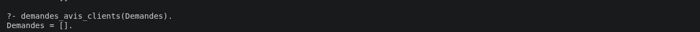
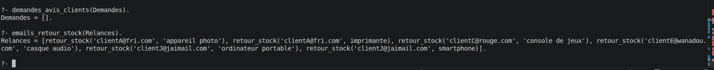
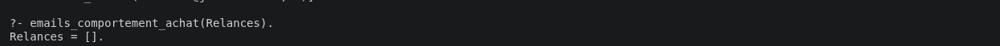
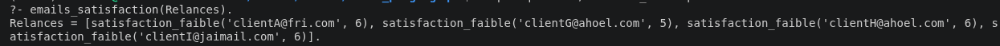
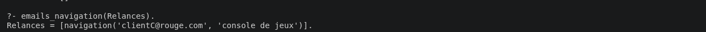
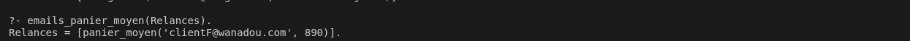

## Règle 1

Un seul panier abandoné dans les 24 heures.

## Règle 2

## Règle 3

(j'ai changé une date de naissance pour tester la règle)

## Règle 4

## Règle 5
La règledonne une liste vide car il n'y a pas d'achat pile une semaine la date

## Règle 6

## Règle 7

Pour cette règle, j'ai regardé les achats d'un même produit dans un même mois.
Avec les données du sujet ça ne donne rien car personne n'a acheté plus de deux fois le même produit dans un mois.

## Règle 8

Les clients avec une satisfaction strictement inférieure à 7 sont relancés.

## Règle 9

## Règle 10

Je calcule le panier moyen sur les achats des 90 derniers jours.
Le seul client au dessus de 500 euros est le client F.

