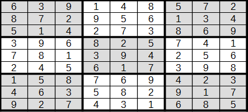
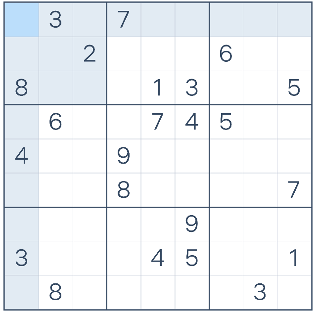

## Coloration de graphes
 
La coloration de graphe a plusieurs applications concrètes :
- Ordonnancement et planification : chaque couleur représente un créneau horaire ou une ressource (ex. : machines, salles). Deux tâches en conflit (liées par une arête) ne peuvent pas avoir la même couleur.
- Allocation de fréquences : dans les réseaux mobiles (4G/5G), chaque station de base (antenne) se voit attribuer une fréquence (couleur). Deux stations proches (liées par une arête) ne peuvent pas utiliser la même fréquence pour éviter les interférences.
- Parallélisation de code : Identification de tâches indépendantes (même couleur) pour les exécuter en parallèle sur des cœurs CPU/GPU.
- Planification de mouvements : pour des drones, éviter les collisions en attribuant des trajectoires (couleurs) non conflictuelles.
- ...

Dans un carte plane, 4 couleurs suffisent pour colorier les zones sans que deux zones contigües aient la même valeur.
 

**Définition des variables**

Une zone z possède une couleur c, posons donc $x_{zc}$.

Pour un problème de 10 zones, il y aura donc 40 variables : $x_{13}$ pour le fait que la zone 2 possède la couleur 4, $\neg x_{30}$ pour le fait que la zone 3 n'est pas en couleur 0. 

On suppose les zones numérotées de 0 à 9, et les couleurs de 0 à 3.

On peut poser k=4 (le nombre de couleurs) puis utiliser cette fonction

```
def x(r, c, k=4):
    return r * k + c + 1
```
ainsi x(1,3) donne 8.


**Définir les fonctions suivantes :**

1. ```def au_moins_une_couleur(model):```
Ajoute dans le modèle le fait que dans chaque région r, on ait $(x_{r0} \vee x_{r1} \vee \dots \vee x_{r3} )$ 
 
2. ```def au_plus_une_couleur(model)```
Ajoute dans le modèle le fait que dans chaque région r, on ne peut avoir deux couleurs, par exemple on ne peut avoir 0 et 1 : $\neg (x_{r0} \wedge x_{r1}) =  (\neg x_{r0} \vee \neg x_{r1})$ 

De même on ne peut avoir 0 et 2, .. 1 et 2,  .... 2 et 3.

Les adjacences sont définies par une liste de tuples. Exemple : ```adjacences = [ (0,1),(0,2),(2,7)]``` pour signifier que les régions 0 et 1 sont adjacentes, ainsi que 0 et 2, et 2 et 7.

3. ```def contraintes_adjacences(model, adjacences)```
Ajoute dans le modèle le fait que deux régions adjacentes ne peuvent avoir la même couleur c: $\neg (x_{r1c} \wedge x_{r2c}) =  (\neg x_{r1k} \vee \neg x_{r2k})$ 

**Tester le modèle**

Voici les régions de France Métropolitaine, leurs relations et les 4 couleurs : 

```
REGIONS = [
    "Hauts-de-France", "Normandie", "Île-de-France", "Grand Est",
    "Bretagne", "Pays de la Loire", "Centre-Val de Loire",
    "Bourgogne-Franche-Comté", "Nouvelle-Aquitaine",
    "Auvergne-Rhône-Alpes", "Occitanie", "PACA"
]

ADJACENCES = [
    (0,1),(0,2),(0,3),(1,2),(1,4),(1,5),(2,3),(2,6),(2,7),
    (3,7),(4,5),(5,6),(5,8),(6,7),(6,8),(6,9),(6,10),(7,9),
    (8,9),(8,10),(9,10),(9,11),(10,11)
]

COULEURS = ["Rouge", "Vert", "Bleu", "Jaune"]
```

- Implémenter les clauses, 
- Donnez le nb de clauses, 
- lancer  la résolution
```m =build_sudoku_solver()
if m.solve():m.get_model()
```
- et afficher la solution proprement.
- vérifier s'il est possible de trouver une solution avec moins de couleurs
 
 

---
## TP SUDOKU

Le Sudoku est un puzzle récent (1979). Dans sa forme classique, il consiste à remplir une grille de 9x9 de nombres entre 1 et 9 avec ces contraintes : 
 - aucun chiffre ne peut être utilisé plus d'une fois sur une ligne
 - aucun chiffre ne peut être utilisé plus d'une fois sur une colonne
 - aucun chiffre ne peut être utilisé plus d'une fois dans les blocs 3x3 qui découpent la grille.

 Voici un exemple de Sudoku : 

 
 **Les variables**
 
 Il faut trouver l'astuce qui permettent d'utiliser un solver booleen.
 C'est-à-dire la signification des variables.  
 On peut poser $x_{ijk}$ le fait que la cellule en $(i,j)$ soit de couleur $k$.

 On peut utiliser cette fonction : 
```
def x(i,j,k):
    return (i-1)*81 + (j-1)*9 + k
```
Il y a donc $9 \times 9 \times 9  = 729$ variables.

Ainsi, 
  - placer la valeur 1 dans la case 1,1 correspond à la variable 1
  - placer la valeur 9 dans la case 9,9 correspond à la variable 729

---
Définissez les fonctions qui ajoutent les contraintes au solveur (Glucose3 par exemple) : 

  - `def au_moins_une(model):`  
chaque case (i,j) possède au moins une valeur parmi 1 à 9 : $(x_{ij1} \vee x_{ij2} \vee \dots x_{ij9} )$

  - `def au_plus_une(model):`  
chaque case (i,j) possède au plus une valeur parmi 1 à 9. Il n'est pas possible d'avoir la valeur 1 et la valeur 2 :  $\neg (x_{ij1} \wedge x_{ij2}) \equiv (\neg  x_{ij1} \vee \neg x_{ij2}) $.  
De même il n'est pas possible d'avoir la valeur 1 et la valeur 3, ..., ni la valeur 8 et la valeur 9.  
*$[-1,-2]$ signifie que la case en $(1,1)$ ne peut être égale à 1 et à 2.* 

  - `def contraintes_lignes(model):`  
pour une ligne i donnée, chaque colonne doit avoir un chiffre différent.  Il n'est pas possible d'avoir la valeur k dans les case (i,1) et (i,2) :  $\neg (x_{i1k} \wedge x_{i2k}) \equiv (\neg  x_{i1k} \vee \neg x_{i2k}) $.  
De même, il n'est pas possible d'avoir k en colonne 1 et 3, ... 1 et 9, 2 et 3, ...., 8 et 9.

  - `def contraintes_colonnes(model):`  
pour une colonne j donnée, chaque ligne doit avoir un chiffre différent.  Il n'est pas possible d'avoir la valeur k dans les case (1,j) et (2,j) :  $\neg (x_{1jk} \wedge x_{2jk}) \equiv (\neg  x_{1jk} \vee \neg x_{2jk}) $.  
De même, il n'est pas possible d'avoir k en lignes 1 et 3, ... 1 et 9, 2 et 3, ...., 8 et 9.

  - `def contraintes_blocs(model):`  
pour un bloc 3x3 donnée, chaque cellule doit avoir un chiffre différent.

  - *combien de clauses sont ajoutées au modèle ?*
----
**Tester**

Il devrait être possible de demander un sudoku rempli.  
Utilisez les fonctions suivantes : 

```

# créer le solver et ajouter les contraintes
def build_sudoku_solver() -> Glucose3:
    solver = Glucose3()
    au_moins_une(solver)
    au_plus_une(solver)
    contraintes_lignes(solver)
    contraintes_colonnes(solver)
    contraintes_blocs(solver)
    return solver

#affichage "agréable" du sudoku
def display_solution(model):
    solution = [[0 for _ in range(9)] for _ in range(9)]
    for i in range(1,10):
        for j in range(1,10):
            for k in range(1, 10):
                if model.get_model()[x(i,j,k)-1] > 0:
                    solution[i-1][j-1] = k
    for ligne in solution:
        print(" ".join(str(k) for k in ligne))

```
Il vous reste à créer une instance de solver et à tester..
```
from pysat.solvers import Glucose3

m =build_sudoku_solver()
if m.solve():
    display_solution(m)

```
----
**Ajouter des indices**
Le puzzle demande de remplir une grille à partir d'un pré remplissage.

On suppose les indices sous cette forme : 
`[(1, 1, 3), (8,7,5)]` pour indiquer que 3 est en position (1,1) et 5 en position (8,7).  
Ceci correspond aux clauses posivites $(x_{113})$ et $(x_{875})$.


Créer la fonction
`def add_indices(model, indices)`  
qui ajoute les clauses correspondant aux indices dans le modèle.

---
Résolvez le Sudoku suivant : 


